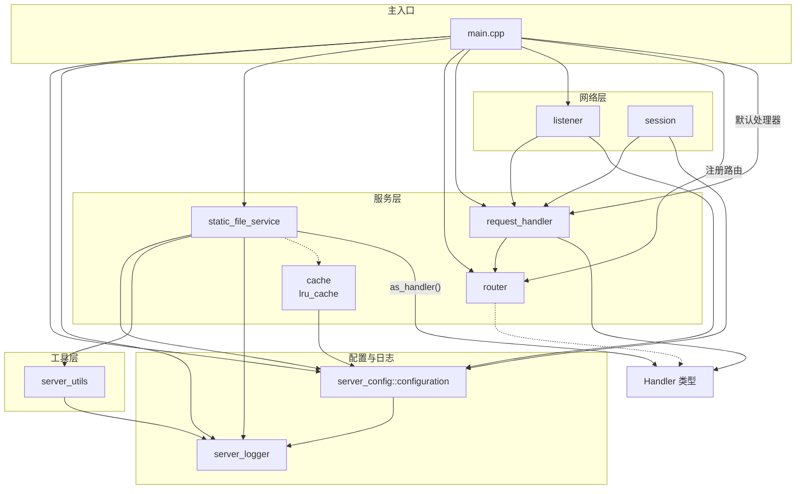
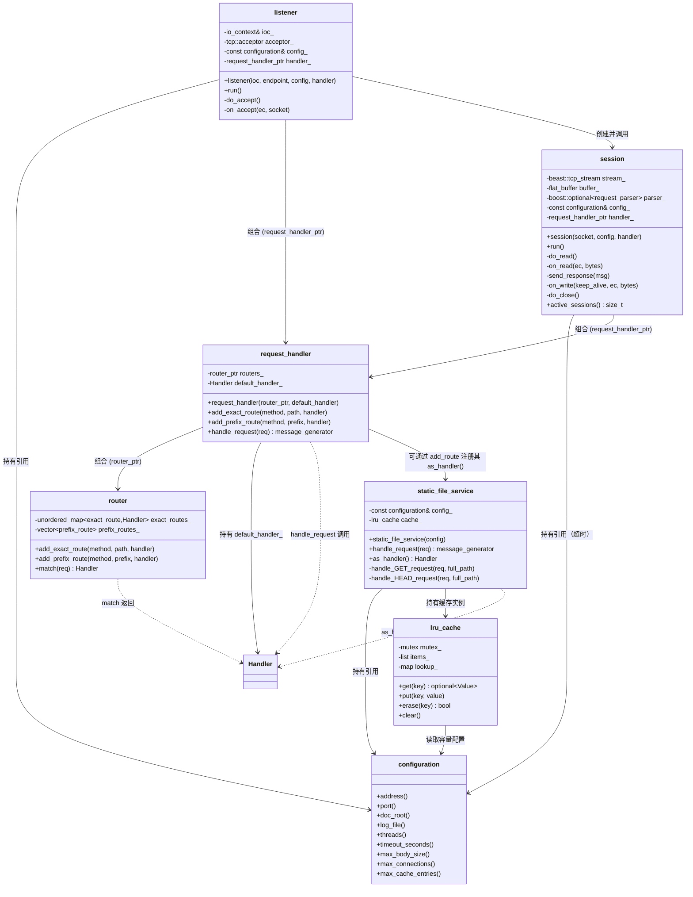

# HTTP 服务器

> **START**
> **2026.4.1**
>
> **version 0.0.1**
> **2026.5.5**

## 项目简介 Description

**http-server** 基于**Boost.Asio Boost.Beast** 进行编写，提供异步的http服务器实现

- 设计背景：学习Asio异步模型，异步服务器的工作原理

-----

## 包依赖

- **Boost**
  - **Asio**
  - **Beast**
  - **Filesystem**
  - **JSON**
  - **Log**
  - **Program Options**
  - **Thread**

-----

## 功能特性 Features

> 实现 HTTP/1.1 异步并发 超时控制 路由分发 静态文件服务
> 配置系统（JSON + 命令行） 结构化日志（控制台 + 文件轮转）
> 请求日志（方法 + 路径 + 耗时） 优雅关闭（信号捕获 + 会话排空 + 强制超时）
> 路径穿越防护（双重校验） 请求体大小限制（413）
> 连接限流（503 + Retry-After 头） LRU 文件内容缓存（线程安全，可配置容量）
> Google Test 单元测试 + 端到端集成测试（57 用例全通过）

## 项目结构

### [目录 contents](./docs/CONTENTS.md)

> 目录汇总，包含各个模块的引用
>

### 模块简述

- **src/main.cpp**
  - 项目入口
- **logger**
  - 日志模块
- **config**
  - 配置模块
- **utils**
  - 工具模块
- **static_file_service**
  - 静态文件服务模块
- **cache**
  - LRU 缓存模块，泛型模板，多线程安全
- **router**
  - 路由模块，管理精确路由与前缀路由匹配
- **request_handler**
  - 请求处理模块
- **server**
  - 连接监听与管理模块，包含 listener 和 session
- **graceful_shutdown**
  - 优雅关闭模块，处理 SIGINT/SIGTERM 信号

- ***test/***
  - Google Test 单元测试（57 用例覆盖 config、logger、router、utils、集成测试模块）

-----

### 结构简图



#### 核心结构简图



## 服务器设计结构

### 三层结构

- **static_file_service**
  - 静态文件处理，生成相应的http响应报文
  - 为request_handler提供响应报文
- **request_handler**
  - 请求处理，管理各个功能路由，包含静态文件处理路由
  - 将传来的请求，发送至相应的文件处理模块，获取响应报文
- **session**
  - 会话处理，处理服务器与客户的连接

-----

## TODO

| 特性 | 优先级 | 说明 |
|:----:|:------:|:----:|
| **POST/DELETE 方法支持** | P3 | 扩展动态 API |
| **HTTPS 支持** | P3 | 集成 boost::asio::ssl |
| **Range 请求** | P3 | 支持断点续传 |
| **统计接口（/metrics）** | P3 | QPS、活跃连接数等指标 |
| **C++20 协程** | P3 | 迁移到 Asio 的 C++20 协程模型 |

## 快速开始 Getting Start

> **>= C17**
> **Boost >= 1.83**
>

### 构建可执行文件

```bash
:$ make http_server
# 或
:$ make
```

### 启动参数

可通过命令行参数或 JSON 配置文件配置服务器，优先级：**命令行 > JSON > 默认值**

```bash
:$ ./http_server --port 8080 --doc_root ./app/ --threads 4 --log_file ./logs/app.log
```

### 配置文件

> 默认查找 CWD 下的 `config.json`，可通过 `--config` 指定路径
>

```json
{
    "address":"0.0.0.0",
    "port":8080,
    "doc_root":"./app/",
    "log_file":"./logs/http_server.log",
    "threads":1,
    "timeout_seconds":30,
    "max_body_size":10485760,
    "max_connections":10000,
    "max_cache_entries":64
}
```

-----

## 文件结构

```text
.
├── CMakeLists.txt          # 顶层 CMake 构建文件
├── config.json             # 服务器配置文件
├── makefile                # 顶层 Makefile
├── README.md               # 本文件
├── TODO.md                 # 功能扩展清单
├── app/
│   ├── test.html           # 响应测试页面
│   ├── style.css           # test.html 样式表
│   └── index.html          # 测试用静态页面
├── docs/
│   ├── CONTENTS.md         # 文档目录
│   ├── cache.md
│   ├── logger.md
│   ├── request_handler.md
│   ├── router.md
│   ├── server.md
│   ├── static_file_service.md
│   └── utils.md
├── includes/
│   ├── cache.hpp
│   ├── config.hpp
│   ├── graceful_shutdown.hpp
│   ├── logger.hpp
│   ├── request_handler.hpp
│   ├── router.hpp
│   ├── server.hpp
│   ├── static_file_service.hpp
│   └── utils.hpp
├── src/
│   ├── CMakeLists.txt
│   ├── config.cpp
│   ├── graceful_shutdown.cpp
│   ├── main.cpp
│   ├── request_handler.cpp
│   ├── router.cpp
│   ├── server.cpp
│   ├── static_file_service.cpp
│   └── utils.cpp
└── test/
    ├── CMakeLists.txt
    ├── makefile
    ├── test_config.cpp
    ├── test_integration.cpp
    ├── test_logger.cpp
    ├── test_router.cpp
    └── test_utils.cpp
```

-----

## [压力测试](./stress_test.md)

-----

## END
