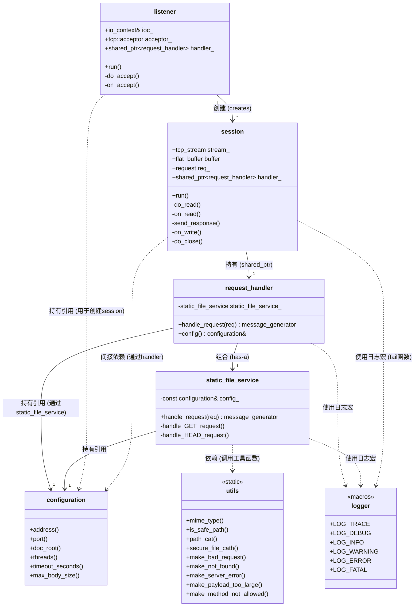

# HTTP 服务器

> **START**
> **2026.4.1**
>
> **version 0.0.1**
> **2026.5.X**
>

## 项目简介 Description

**http-server** 基于**Boost.Asio Boost.Beast** 进行编写，提供异步的http服务器实现

- 设计背景：学习Asio异步模型，异步服务器的工作原理

-----

## 包依赖

- **Boost**
    - **Asio**
    - **Beast**
    - **Filesystem**
    - **JSON**
    - **Log**

## 功能特性 Features

> 实现 HTTP/1.1 异步并发 超时控制
>

## 项目结构

### [目录 contents](./docs/contents.md)

> 目录汇总，包含各个模块的引用
>

**模块简述**

- **logger**
  - 日志模块
- **config**
  - 配置模块
- **utils**
  - 工具模块
- **static_file_service**
  - 静态文件服务模块
- **request_handler**
  - 请求处理模块
- **server**
  - 连接监听与管理模块

- ***test/***
  - 测试单元



## 服务器设计结构

**三层结构**

- **static_file_service**
  - 静态文件处理，生成相应的http响应报文
  - 为request_handler提供响应报文
- **request_handler**
  - 请求处理，管理各个功能路由，包含静态文件处理路由
  - 将传来的请求，发送至相应的文件处理模块，获取响应报文
- **session**
  - 会话处理，处理服务器与客户的连接

## TODO

1. 优雅关闭 + 请求大小限制 + 路径规范化
2. [x] 结构化日志 + 请求日志 **logger** 模块
    - 后期添加配置文件对日志进行灵活配置
    - 异步记录，避免日志I/O阻塞网路主进程
    - 日志级别
    - 多线程安全支持
    - 结构化的日志输出
    - 多目标输出（Sink）
      - 控制台
      - 日志文件
    - 日志切分保证日志文件大小，避免过大的单个文件
3. 动态路由（无中间件）
4. [x] 配置文件支持 **config** 模块，实现基于JSON文件的功能配置
5. Range 请求 + 缓存控制
6. 统计接口（/metrics）
7. 单元测试（使用Google Test 关键模块）
8. 添加完整的 ***HTTP/1.1 + 并发 + 超时控制*** 功能
9. HTTPS 支持
10. 增加C++20协程，HTTPS，高级网络特性

- 目的是产出一个可配置、可处理并发连接的、代码结构清晰的静态文件服务器

## 快速开始 Getting Start

> **>= C17**
>

**构建可执行文件**

```bash
$ make http_server
# 或
$ make
```


## 文件结构

```text
.
├── CMakeLists.txt
├── docs
│   └── logger.md
├── index.html
├── logs
│   └── http_server.log
├── makefile
├── README.md
├── src
│   ├── logger.hpp
│   ├── main.cpp
│   ├── request_handler.hpp
│   ├── router.hpp
│   ├── server.hpp
│   └── utils.hpp
└── test
     └── test.cpp
```

## END
