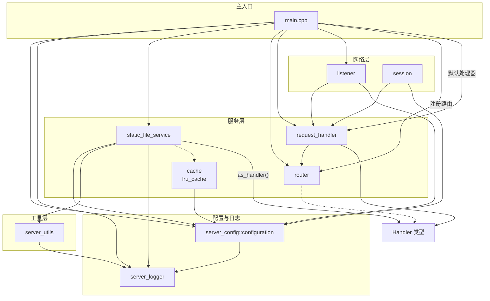
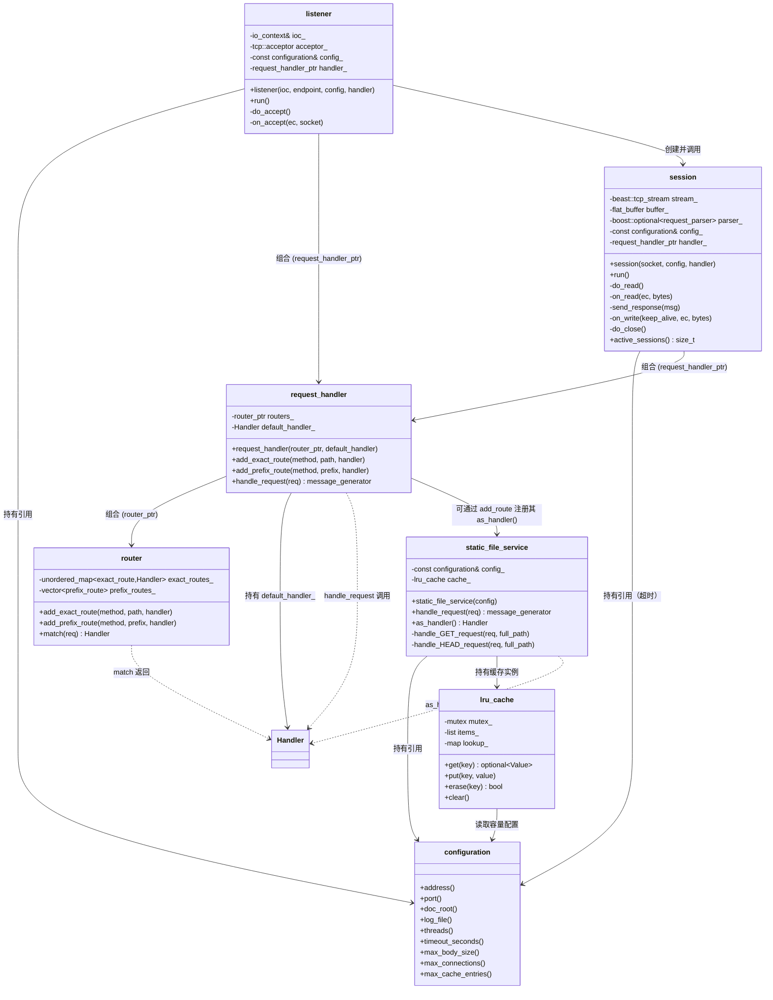

# 架构设计 Architecture

## 结构简图



## 核心结构简图



## 服务器设计结构

### 三层结构

- **static_file_service**
  - 静态文件处理，生成相应的http响应报文
  - 为request_handler提供响应报文
- **request_handler**
  - 请求处理，管理各个功能路由，包含静态文件处理路由
  - 将传来的请求，发送至相应的文件处理模块，获取响应报文
- **session**
  - 会话处理，处理服务器与客户的连接

## 目录结构

```text
.
├── .github/
│   └── workflows/
│       ├── http-server-ci.yml   # 持续集成
│       └── http-server-cd.yml   # 持续部署
├── CMakeLists.txt          # 顶层 CMake 构建文件
├── Dockerfile              # 容器化构建
├── LICENSE                 # 开源许可
├── Makefile                # 顶层 Makefile
├── README.md               # 本文件
├── TODO.md                 # 功能扩展清单
├── app/
│   ├── index.html          # 测试用静态页面
│   ├── style.css           # index.html 样式表
│   └── test.html           # 响应测试页面
├── config.json             # 服务器配置文件
├── docs/
│   ├── CONTENTS.md         # 文档目录
│   ├── architecture.md     # 架构设计：结构简图 / 类图 / 三层设计 / 目录结构
│   ├── cache.md
│   ├── config.md
│   ├── graceful_shutdown.md
│   ├── logger.md
│   ├── request_handler.md
│   ├── router.md
│   ├── server.md
│   ├── static_file_service.md
│   └── utils.md
├── includes/
│   ├── cache.hpp
│   ├── config.hpp
│   ├── graceful_shutdown.hpp
│   ├── logger.hpp
│   ├── request_handler.hpp
│   ├── router.hpp
│   ├── server.hpp
│   ├── static_file_service.hpp
│   └── utils.hpp
├── src/
│   ├── CMakeLists.txt
│   ├── config.cpp
│   ├── graceful_shutdown.cpp
│   ├── main.cpp
│   ├── request_handler.cpp
│   ├── router.cpp
│   ├── server.cpp
│   ├── static_file_service.cpp
│   └── utils.cpp
├── stress-test/
│   └── stress-test.md      # 压力测试报告
└── test/
    ├── CMakeLists.txt
    ├── makefile
    ├── config.json         # 测试用服务器配置
    ├── test_config.cpp
    ├── test_integration.cpp
    ├── test_logger.cpp
    ├── test_router.cpp
    └── test_utils.cpp
```
