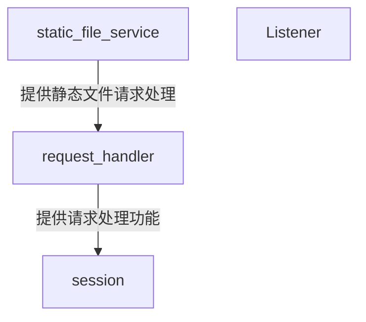

# server

> ***/includes/server.hpp***
> ***连接监听与管理模块***
>

> 依赖:
> ***Boost::Beast***
> ***Boost::Asio***
> ***boost::optional***
> ***logger.hpp***
> ***request_handler.hpp***
>

## 结构

所有定义都包含在 ***namespace server_host*** 命名空间中

### 处理请求的三层结构

- **[static_file_service](./static_file_service.md)**
  - 为request_handler提供静态文件的处理功能
- **[request_handler](./request_handler.md)**
  - 处理客户端发来的请求
- session 处理客户端的异步I/O

## 类实现

包含两个类:

- **listener**
  > 监听请求

- **session**
  > 管理连接

### session 类

- ***using*** `std::shared_ptr<server_service::request_handler>` **request_handler_ptr**

#### 成员变量

##### private

- `beast::tcp_stream` **stream_**
  - TCP连接流
- `beast::flat_buffer` **buffer_**
  - 平坦的缓存区域
- `boost::optional<http::request_parser<http::string_body>>` **parser_**
  - 请求分析器（boost::optional 包裹，每次读前 emplace 新实例）
  - 通过 `body_limit()` 在解析阶段即限制请求体大小，超出返回 413
  - 该版本 Boost.Beast 的 parser 为单次使用设计，不可重置，故以 optional 存储
- `const server_config::configuration&` **config_**
  - 服务器配置引用
- `request_handler_ptr` **handler_**
  - 请求处理对象的共享指针

#### 成员函数

##### public

- **run**
  > 开始异步处理

- **do_read**
  > 处理流读取：emplace 新 parser → 设置 body_limit → 异步读
  > 解析阶段即拦截超大请求体，返回 413 而非耗尽内存

- **on_read**
  > 流读取回调：从 `parser_->get()` 获取解析后的请求，交给 handler 处理
  - **args**
    - `beast::error_code` **ec**
    - `std::size_t` **bytes_transferred**

- **send_response**
  > 发回响应
  - **args**
    - `http::message_generator&&` **msg**

- **on_write**
  > 写操作完成回调：根据 keep_alive 决定关闭连接或继续读下一请求
  - **args**
    - `bool` **keep_alive**
    - `beast::error_code` **ec**
    - `std::size_t` **bytes_transferred**

- **do_close**
  > 关闭连接

- **active_sessions** (static)
  > 返回当前活跃的 HTTP 会话数（原子计数器）

#### 构造函数

目前仅包含唯一的构造函数

- `session(tcp::socket&& socket, const server_config::configuration& config, request_handler_ptr handler)`
  - 获取套接字所有权，活跃会话数 +1

-----

### listener 类

- ***using*** `std::shared_ptr<server_service::request_handler>` **request_handler_ptr**

#### 成员变量

##### private

- `net::io_context&` **ioc_**
  - Asio异步上下文
- `tcp::acceptor` **acceptor_**
  - 监听，接收器
- `const server_config::configuration&` **config_**
  - 服务器配置引用
- `request_handler_ptr` **handler_**
  - 请求处理对象的共享指针
- `bool` **is_stopped_**
  - 标记是否已停止接受新连接（优雅关闭用）

#### 成员函数

##### private

- **do_accept**
  > 监听网络端口

- **on_accept**
  > 从端口接收报文
  - **args**
    - `beast::error_code` **ec**
    - `tcp::socket` **socket**

##### public

- **run**
  > 开始进行监听网络端口

- **stop**
  > 停止接受新连接（设置 is_stopped_ = true 并关闭 acceptor）

#### 构造函数

目前仅包含唯一的构造函数

- `listener(net::io_context& ioc, tcp::endpoint endpoint, const server_config::configuration& config, request_handler_ptr handler)`
  - 初始化 acceptor，设置地址复用、绑定、监听
