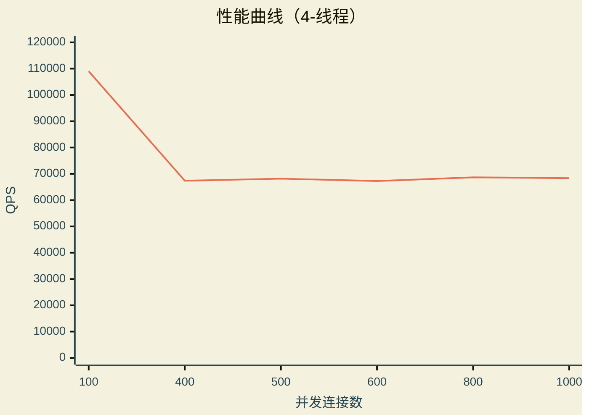
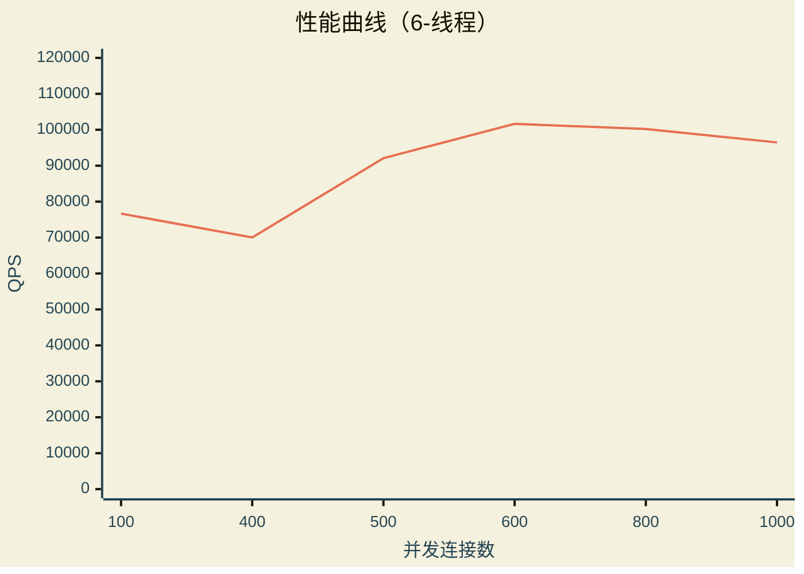
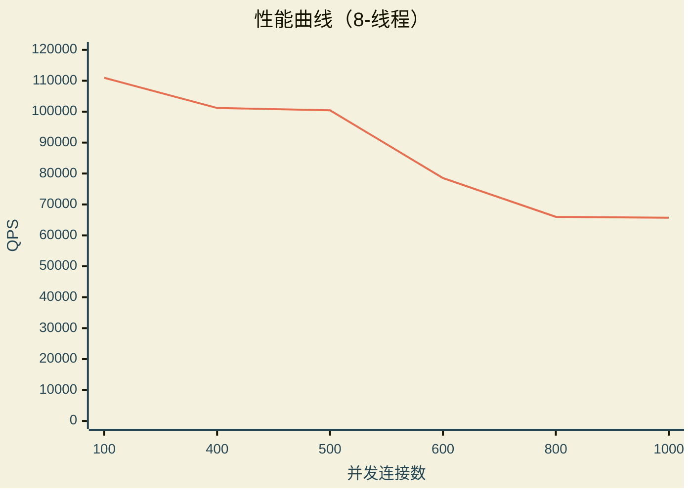
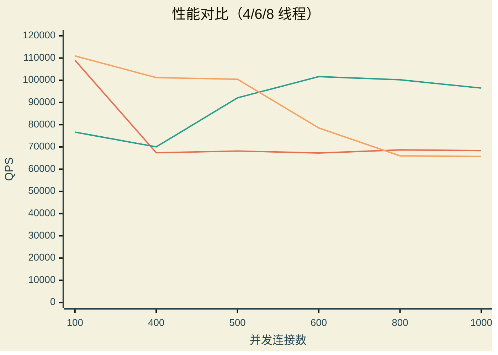

# 压力测试

> 该压力测试基于 **wrk** 工具
> ***[wrk tool](https://github.com/wg/wrk)***

> 最新压测以 [stress-test-record/stress_test_2026_08_07.md](./stress-test-record/stress_test_2026_08_07.md) 为准（kernel 7.1.6，峰值 ~153k QPS）

使用示例

```bash
:$ wrk -t8 -c400 -d30s http://<静态文件>

:$ wrk -t8 -c400 -d30s http://localhost:8080/index.html
```

## 测试平台

```text
Operating System: Fedora Linux 44 (KDE Plasma Desktop Edition)
Kernel Version: 7.1.5-201.fc44.x86_64
Session: Wayland

Processors: 12th Gen Intel(R) Core(TM) i5-1235U @ 1.3GHz (10 Cores / 12 Threads, 2P+8E, Turbo 4.4GHz)
Memory: 15 GiB
Model: Lenovo ThinkPad T14 Gen 3
```

## 测试

以下测试以 `./http_server --threads 8` 为测试基础

### 4 线程测试

以下压力测试参数基于：4线程，[100 400 500 600 800 1000] 连接、30秒

```bash
$ ./wrk -t4 -c100 -d30s http://0.0.0.0:8080/index.html

Running 30s test @ http://0.0.0.0:8080/index.html
  4 threads and 100 connections
  Thread Stats   Avg      Stdev     Max   +/- Stdev
    Latency     0.92ms  540.60us  26.14ms   91.65%
    Req/Sec    27.40k    10.29k   45.09k    61.83%
  3271708 requests in 30.01s, 28.14GB read
Requests/sec: 109014.17
Transfer/sec:      0.94GB
```

```bash
$ ./wrk -t4 -c400 -d30s http://0.0.0.0:8080/index.html

Running 30s test @ http://0.0.0.0:8080/index.html
  4 threads and 400 connections
  Thread Stats   Avg      Stdev     Max   +/- Stdev
    Latency     5.90ms    1.34ms 155.00ms   96.59%
    Req/Sec    16.95k   701.58    18.44k    71.33%
  2024726 requests in 30.05s, 17.42GB read
Requests/sec:  67368.74
Transfer/sec:    593.39MB
```

```bash
$ ./wrk -t4 -c500 -d30s http://0.0.0.0:8080/index.html

Running 30s test @ http://0.0.0.0:8080/index.html
  4 threads and 500 connections
  Thread Stats   Avg      Stdev     Max   +/- Stdev
    Latency     7.62ms    9.06ms 472.15ms   99.75%
    Req/Sec    17.15k     1.08k   24.43k    83.25%
  2048379 requests in 30.05s, 17.62GB read
Requests/sec:  68167.10
Transfer/sec:    600.43MB
```

```bash
$ ./wrk -t4 -c600 -d30s http://0.0.0.0:8080/index.html

Running 30s test @ http://0.0.0.0:8080/index.html
  4 threads and 600 connections
  Thread Stats   Avg      Stdev     Max   +/- Stdev
    Latency     9.30ms   11.44ms 580.06ms   99.75%
    Req/Sec    16.93k     0.91k   25.80k    84.83%
  2021738 requests in 30.06s, 17.39GB read
Requests/sec:  67253.55
Transfer/sec:    592.38MB
```

```bash
$ ./wrk -t4 -c800 -d30s http://0.0.0.0:8080/index.html

Running 30s test @ http://0.0.0.0:8080/index.html
  4 threads and 800 connections
  Thread Stats   Avg      Stdev     Max   +/- Stdev
    Latency    12.49ms   20.36ms 899.53ms   99.69%
    Req/Sec    17.29k   682.05    24.54k    85.92%
  2064319 requests in 30.06s, 17.76GB read
Requests/sec:  68674.02
Transfer/sec:    604.89MB
```

```bash
$ ./wrk -t4 -c1000 -d30s http://0.0.0.0:8080/index.html

Running 30s test @ http://0.0.0.0:8080/index.html
  4 threads and 1000 connections
  Thread Stats   Avg      Stdev     Max   +/- Stdev
    Latency    18.71ms   60.37ms   1.74s    99.30%
    Req/Sec    17.20k   664.12    25.04k    92.33%
  2054292 requests in 30.05s, 17.67GB read
Requests/sec:  68351.74
Transfer/sec:    602.05MB
```

### 6 线程测试

以下压力测试参数基于：6线程，[100 400 500 600 800 1000] 连接、30秒

```bash
$ ./wrk -t6 -c100 -d30s http://0.0.0.0:8080/index.html

Running 30s test @ http://0.0.0.0:8080/index.html
  6 threads and 100 connections
  Thread Stats   Avg      Stdev     Max   +/- Stdev
    Latency     1.24ms  257.52us  20.93ms   90.54%
    Req/Sec    12.84k   295.45    13.85k    93.89%
  2300765 requests in 30.01s, 19.79GB read
Requests/sec:  76663.33
Transfer/sec:    675.26MB
```

```bash
$ ./wrk -t6 -c400 -d30s http://0.0.0.0:8080/index.html

Running 30s test @ http://0.0.0.0:8080/index.html
  6 threads and 400 connections
  Thread Stats   Avg      Stdev     Max   +/- Stdev
    Latency     5.69ms    2.81ms 228.58ms   99.65%
    Req/Sec    11.75k   356.91    15.71k    93.22%
  2103967 requests in 30.05s, 18.10GB read
Requests/sec:  70014.18
Transfer/sec:    616.69MB
```

```bash
$ ./wrk -t6 -c500 -d30s http://0.0.0.0:8080/index.html

Running 30s test @ http://0.0.0.0:8080/index.html
  6 threads and 500 connections
  Thread Stats   Avg      Stdev     Max   +/- Stdev
    Latency     5.48ms    3.96ms 305.65ms   99.76%
    Req/Sec    15.44k     2.54k   17.89k    67.89%
  2765466 requests in 30.03s, 23.79GB read
Requests/sec:  92078.11
Transfer/sec:    811.04MB
```

```bash
$ ./wrk -t6 -c600 -d30s http://0.0.0.0:8080/index.html

Running 30s test @ http://0.0.0.0:8080/index.html
  6 threads and 600 connections
  Thread Stats   Avg      Stdev     Max   +/- Stdev
    Latency     6.62ms   14.84ms 594.30ms   99.61%
    Req/Sec    17.06k   694.49    30.14k    94.11%
  3056332 requests in 30.07s, 26.29GB read
Requests/sec: 101649.07
Transfer/sec:      0.87GB
```

```bash
$ ./wrk -t6 -c800 -d30s http://0.0.0.0:8080/index.html

Running 30s test @ http://0.0.0.0:8080/index.html
  6 threads and 800 connections
  Thread Stats   Avg      Stdev     Max   +/- Stdev
    Latency     9.92ms   31.64ms   1.01s    99.41%
    Req/Sec    16.82k     0.86k   30.20k    95.56%
  3011689 requests in 30.05s, 25.91GB read
Requests/sec: 100208.84
Transfer/sec:      0.86GB
```

```bash
$ ./wrk -t6 -c1000 -d30s http://0.0.0.0:8080/index.html

Running 30s test @ http://0.0.0.0:8080/index.html
  6 threads and 1000 connections
  Thread Stats   Avg      Stdev     Max   +/- Stdev
    Latency    11.78ms   28.75ms   1.09s    99.59%
    Req/Sec    16.19k     0.89k   20.53k    78.61%
  2899930 requests in 30.06s, 24.94GB read
Requests/sec:  96471.17
Transfer/sec:    849.73MB
```

### 8 线程测试

以下压力测试参数基于：8线程，[100 400 500 600 800 1000] 连接、30秒

```bash
$ ./wrk -t8 -c100 -d30s http://0.0.0.0:8080/index.html

Running 30s test @ http://0.0.0.0:8080/index.html
  8 threads and 100 connections
  Thread Stats   Avg      Stdev     Max   +/- Stdev
    Latency     0.86ms  223.87us  25.14ms   90.77%
    Req/Sec    13.97k     1.24k   56.41k    99.08%
  3339478 requests in 30.10s, 28.73GB read
Requests/sec: 110948.44
Transfer/sec:      0.95GB
```

```bash
$ ./wrk -t8 -c400 -d30s http://0.0.0.0:8080/index.html

Running 30s test @ http://0.0.0.0:8080/index.html
  8 threads and 400 connections
  Thread Stats   Avg      Stdev     Max   +/- Stdev
    Latency     4.02ms    3.09ms 218.46ms   99.81%
    Req/Sec    12.73k   411.74    16.77k    84.21%
  3038956 requests in 30.03s, 26.14GB read
Requests/sec: 101198.21
Transfer/sec:      0.87GB
```

```bash
$ ./wrk -t8 -c500 -d30s http://0.0.0.0:8080/index.html

Running 30s test @ http://0.0.0.0:8080/index.html
  8 threads and 500 connections
  Thread Stats   Avg      Stdev     Max   +/- Stdev
    Latency     5.29ms    8.74ms 414.03ms   99.71%
    Req/Sec    12.64k   476.19    20.61k    90.08%
  3017243 requests in 30.04s, 25.95GB read
Requests/sec: 100448.57
Transfer/sec:      0.86GB
```

```bash
$ ./wrk -t8 -c600 -d30s http://0.0.0.0:8080/index.html

Running 30s test @ http://0.0.0.0:8080/index.html
  8 threads and 600 connections
  Thread Stats   Avg      Stdev     Max   +/- Stdev
    Latency     8.42ms   15.91ms 616.66ms   99.58%
    Req/Sec     9.88k     2.10k   23.31k    66.54%
  2359967 requests in 30.04s, 20.30GB read
Requests/sec:  78547.79
Transfer/sec:    691.86MB
```

```bash
$ ./wrk -t8 -c800 -d30s http://0.0.0.0:8080/index.html

Running 30s test @ http://0.0.0.0:8080/index.html
  8 threads and 800 connections
  Thread Stats   Avg      Stdev     Max   +/- Stdev
    Latency    17.99ms   69.65ms   1.66s    98.96%
    Req/Sec     8.30k   557.14    17.71k    94.12%
  1982490 requests in 30.04s, 17.05GB read
Requests/sec:  65993.83
Transfer/sec:    581.28MB
```

```bash
$ ./wrk -t8 -c1000 -d30s http://0.0.0.0:8080/index.html

Running 30s test @ http://0.0.0.0:8080/index.html
  8 threads and 1000 connections
  Thread Stats   Avg      Stdev     Max   +/- Stdev
    Latency    21.67ms   80.49ms   1.99s    99.05%
    Req/Sec     8.27k   453.47    12.56k    88.12%
  1974261 requests in 30.04s, 16.98GB read
  Socket errors: connect 0, read 0, write 0, timeout 39
Requests/sec:  65710.91
Transfer/sec:    578.79MB
```

## 性能汇总









## 结果分析

### 整体吞吐

- 18 组测试 QPS 区间：**65,711 ~ 110,948 req/s**，总吞吐约 580 MB/s ~ 0.95 GB/s。
- 峰值出现在低并发：`-t8 -c100` = **110,948 req/s**（延迟 0.86ms），`-t4 -c100` = 109,014 req/s。
- 服务器以 8 线程异步模型（Boost.Asio）可稳定支撑 **10 万级 QPS**；在 c100 低并发下延迟 <1ms，说明请求处理路径本身高效。

### 不同 wrk 线程数的伸缩性

- **-t4**：c100 冲到 109k 后，c400 起**平台化**在 ~67–69k，几乎不随并发变化，且全程无超时。说明 4 个 wrk 线程本身成为客户端上限。
- **-t6**：随并发上升而上升，c600/c800 达 **~101k**，c1000 仍 ~96k。是唯一在高并发下保持 10 万级、且无超时的配置，**综合表现最优**。
- **-t8**：c400–c500 维持 ~100k，c600 起明显下滑（78k → 66k），c1000 出现 **39 个超时**。客户端（8 线程）与服务端（8 线程）在 12 逻辑线程的机器上产生**线程超订（oversubscription）**，客户端自身调度成为瓶颈。

### 延迟

- 低并发（c100）延迟 <1ms，路径高效。
- 高并发下 -t8 延迟恶化最快（c1000 时 21.67ms），-t4 虽有上升但无超时，-t6 居中且最稳定。
- -t8 的延迟分布（Max 1.99s）提示存在排队/调度抖动，属同机客户端竞争所致。

### 瓶颈判断

- 静态文件服务 + LRU 缓存 + keep-alive 下，**服务器本体能力在 10 万 QPS 量级**，未观察到服务端内存/句柄耗尽。
- 高并发下的下滑**同时受客户端（wrk）与服务端同机争抢 CPU** 影响：本机仅 12 逻辑线程（2P+8E），16 个线程必然超订；且 E 核（最高 3.3GHz）吞吐明显低于 P 核（最高 4.4GHz），调度分配不均会放大单次测量波动（例如 -t6 -c500 突增至 92k）。
- 因此 `-c600` 以上的下滑**不能单独归因于服务器**；要得出服务端真实上限，需将 wrk 放到独立机器/核上测量。

## 优化方向

1. **静态文件零拷贝（sendfile / io_uring）**：当前响应体经用户态缓冲拷贝；改用 `sendfile` 让内核直接发送文件内容，显著降低高并发下的 CPU 拷贝开销。
2. **减少每请求堆分配**：`flat_buffer` 复用已实现；可进一步引入固定大小缓冲池/内存池，缓解高并发下的分配与回收抖动。
3. **大文件 mmap**：静态大文件用只读 `mmap` + `MADV_SEQUENTIAL` 映射，配合 LRU 缓存，减少用户态拷贝与缺页开销。
4. **多 accept 队列（SO_REUSEPORT）**：当前多线程共享单个 listener 的 accept；用 `SO_REUSEPORT` 让内核按四元组 hash 分发连接，摊薄 accept 开销，提升高并发建连吞吐。
5. **CPU 亲和性 / P 核绑定**：Alder Lake 混合架构下，将 server 线程绑定到 P 核、wrk 客户端隔离到 E 核（或独立机器），避免延迟敏感路径落到慢核，也消除同机竞争对测量的干扰。
6. **客户端分离测量**：同机 wrk 会严重低估高并发（c800/c1000）下的服务端能力；建议用独立机器/容器跑 wrk，以确定服务端真实上限。
7. **HTTP 条件请求**：为静态资源实现 `ETag`/`Last-Modified` + 条件 GET，二次访问返回 304 减少传输量；叠加 `Cache-Control` 让浏览器缓存，进一步降低实际负载。
8. **连接层调优**：调大 socket 收发缓冲、配置 SO_KEEPALIVE；核对 `max_connections`（当前默认 10000），避免接近上限时 accept 拒绝/背压行为。
9. **超时与限流细化**：-t8 -c1000 出现超时，需区分"服务端处理超时"与"客户端排队超时"；可调大 `timeout_seconds` 或实现更精细的连接级限流（当前为整机 503 限流）。

## END
