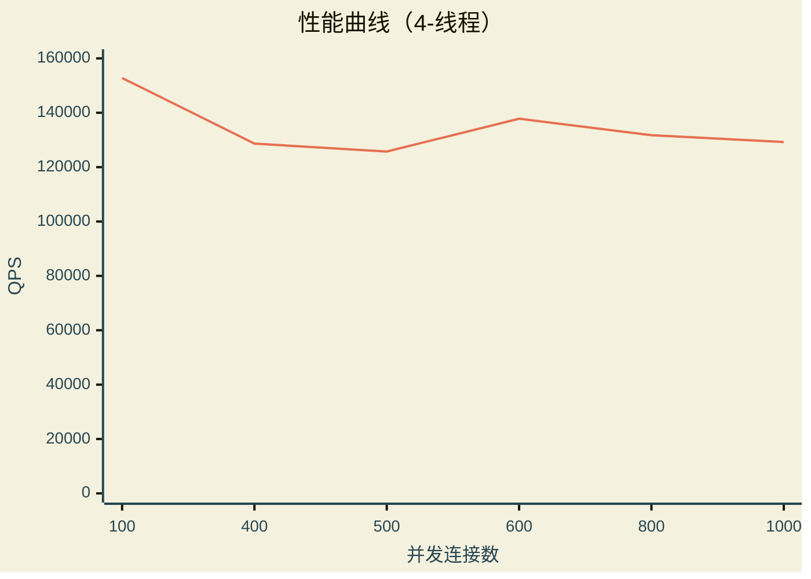
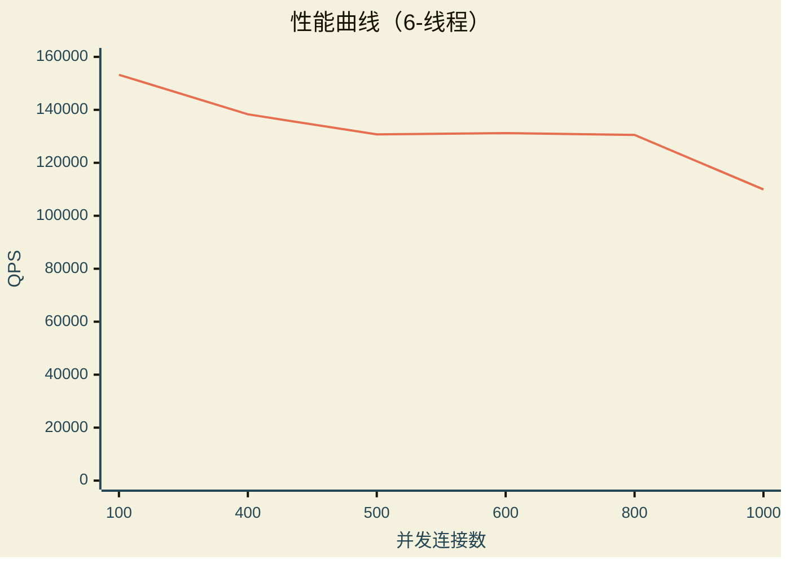
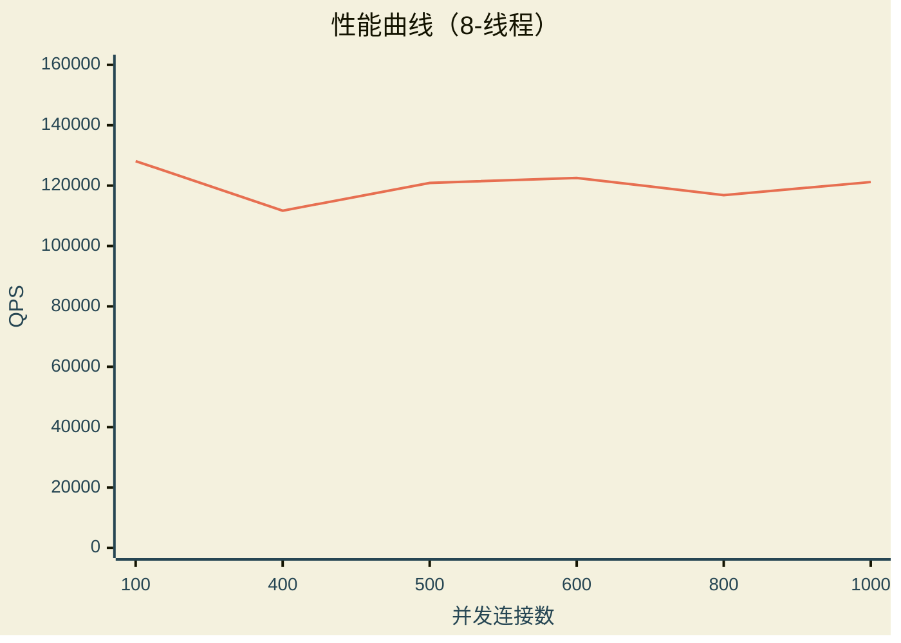

# 压力测试

> 该压力测试基于 **wrk** 工具
> ***[wrk tool](https://github.com/wg/wrk)***

使用示例

```bash
:$ wrk -t8 -c400 -d30s http://<静态文件>

:$ wrk -t8 -c400 -d30s http://localhost:8080/index.html
```

## 测试平台

```text
Operating System: Fedora Linux 44 (KDE Plasma Desktop Edition)
Kernel Version: 7.1.6-201.fc44.x86_64
Session: Wayland

Processors: 12th Gen Intel(R) Core(TM) i5-1235U @ 1.3GHz (10 Cores / 12 Threads, 2P+8E, Turbo 4.4GHz)
Memory: 15 GiB
Model: ThinkPad T14 Gen 3
```

## 测试参数

### http_server

```bash
./http_server --threads 8 --doc_root ./app/ -L warning
```

### wrk

| 参数 | 取值 |
|:---|:---|
| `-t` threads | 4 / 6 / 8 |
| `-c` connection | 100 / 400 / 500 / 600 / 800 / 1000 |
| `-d` delay | 30s |

## 测试

以下测试以 `./http_server --threads 8` 为测试基础

### 4 线程测试

以下压力测试参数基于：4线程，[100 400 500 600 800 1000] 连接、30秒

```bash
$ ./wrk -t4 -c100 -d30s http://0.0.0.0:8080/index.html

Running 30s test @ http://0.0.0.0:8080/index.html
  4 threads and 100 connections
  Thread Stats   Avg      Stdev     Max   +/- Stdev
    Latency   649.33us  481.80us  15.78ms   92.22%
    Req/Sec    38.41k     6.20k   58.80k    75.33%
  4587919 requests in 30.03s, 39.87GB read
Requests/sec: 152795.53
Transfer/sec:      1.33GB
```

```bash
$ ./wrk -t4 -c400 -d30s http://0.0.0.0:8080/index.html

Running 30s test @ http://0.0.0.0:8080/index.html
  4 threads and 400 connections
  Thread Stats   Avg      Stdev     Max   +/- Stdev
    Latency     2.91ms    2.58ms 187.39ms   99.32%
    Req/Sec    32.37k     1.57k   39.35k    71.00%
  3871176 requests in 30.09s, 33.64GB read
Requests/sec: 128662.60
Transfer/sec:      1.12GB
```

```bash
$ ./wrk -t4 -c500 -d30s http://0.0.0.0:8080/index.html

Running 30s test @ http://0.0.0.0:8080/index.html
  4 threads and 500 connections
  Thread Stats   Avg      Stdev     Max   +/- Stdev
    Latency     3.71ms    1.45ms 151.57ms   91.21%
    Req/Sec    31.64k     1.83k   41.92k    70.08%
  3783649 requests in 30.09s, 32.88GB read
Requests/sec: 125730.66
Transfer/sec:      1.09GB
```

```bash
$ ./wrk -t4 -c600 -d30s http://0.0.0.0:8080/index.html

Running 30s test @ http://0.0.0.0:8080/index.html
  4 threads and 600 connections
  Thread Stats   Avg      Stdev     Max   +/- Stdev
    Latency     4.21ms    2.42ms 205.14ms   96.81%
    Req/Sec    34.68k     4.36k   51.81k    82.42%
  4145676 requests in 30.09s, 36.02GB read
Requests/sec: 137797.69
Transfer/sec:      1.20GB
```

```bash
$ ./wrk -t4 -c800 -d30s http://0.0.0.0:8080/index.html

Running 30s test @ http://0.0.0.0:8080/index.html
  4 threads and 800 connections
  Thread Stats   Avg      Stdev     Max   +/- Stdev
    Latency     5.81ms    1.37ms 177.20ms   89.52%
    Req/Sec    33.18k     1.91k   39.58k    80.33%
  3965058 requests in 30.10s, 34.45GB read
Requests/sec: 131741.08
Transfer/sec:      1.14GB
```

```bash
$ ./wrk -t4 -c1000 -d30s http://0.0.0.0:8080/index.html

Running 30s test @ http://0.0.0.0:8080/index.html
  4 threads and 1000 connections
  Thread Stats   Avg      Stdev     Max   +/- Stdev
    Latency     7.93ms   12.75ms 668.64ms   99.77%
    Req/Sec    32.54k     1.63k   43.84k    81.50%
  3889689 requests in 30.10s, 33.80GB read
Requests/sec: 129238.38
Transfer/sec:      1.12GB
```

### 6 线程测试

以下压力测试参数基于：6线程，[100 400 500 600 800 1000] 连接、30秒

```bash
$ ./wrk -t6 -c100 -d30s http://0.0.0.0:8080/index.html

Running 30s test @ http://0.0.0.0:8080/index.html
  6 threads and 100 connections
  Thread Stats   Avg      Stdev     Max   +/- Stdev
    Latency   617.17us  286.49us  13.28ms   92.45%
    Req/Sec    25.68k     2.70k   36.95k    87.89%
  4599373 requests in 30.01s, 39.97GB read
Requests/sec: 153240.70
Transfer/sec:      1.33GB
```

```bash
$ ./wrk -t6 -c400 -d30s http://0.0.0.0:8080/index.html

Running 30s test @ http://0.0.0.0:8080/index.html
  6 threads and 400 connections
  Thread Stats   Avg      Stdev     Max   +/- Stdev
    Latency     2.79ms    0.99ms 112.98ms   96.90%
    Req/Sec    23.19k   566.15    28.63k    69.06%
  4156004 requests in 30.05s, 36.11GB read
Requests/sec: 138315.91
Transfer/sec:      1.20GB
```

```bash
$ ./wrk -t6 -c500 -d30s http://0.0.0.0:8080/index.html

Running 30s test @ http://0.0.0.0:8080/index.html
  6 threads and 500 connections
  Thread Stats   Avg      Stdev     Max   +/- Stdev
    Latency     3.81ms    4.00ms 266.76ms   99.84%
    Req/Sec    21.93k   701.94    31.78k    80.00%
  3930615 requests in 30.07s, 34.15GB read
Requests/sec: 130732.73
Transfer/sec:      1.14GB
```

```bash
$ ./wrk -t6 -c600 -d30s http://0.0.0.0:8080/index.html

Running 30s test @ http://0.0.0.0:8080/index.html
  6 threads and 600 connections
  Thread Stats   Avg      Stdev     Max   +/- Stdev
    Latency     4.91ms   10.50ms 475.05ms   99.70%
    Req/Sec    22.02k     1.23k   36.67k    78.67%
  3947045 requests in 30.08s, 34.30GB read
Requests/sec: 131203.59
Transfer/sec:      1.14GB
```

```bash
$ ./wrk -t6 -c800 -d30s http://0.0.0.0:8080/index.html

Running 30s test @ http://0.0.0.0:8080/index.html
  6 threads and 800 connections
  Thread Stats   Avg      Stdev     Max   +/- Stdev
    Latency     6.27ms    8.05ms 484.50ms   99.83%
    Req/Sec    21.90k   675.24    26.59k    80.17%
  3923904 requests in 30.06s, 34.10GB read
Requests/sec: 130530.45
Transfer/sec:      1.13GB
```

```bash
$ ./wrk -t6 -c1000 -d30s http://0.0.0.0:8080/index.html

Running 30s test @ http://0.0.0.0:8080/index.html
  6 threads and 1000 connections
  Thread Stats   Avg      Stdev     Max   +/- Stdev
    Latency    11.40ms   38.65ms   1.20s    99.38%
    Req/Sec    18.45k     4.01k   29.60k    70.56%
  3309319 requests in 30.10s, 28.76GB read
Requests/sec: 109941.63
Transfer/sec:      0.96GB
```

### 8 线程测试

以下压力测试参数基于：8线程，[100 400 500 600 800 1000] 连接、30秒

```bash
$ ./wrk -t8 -c100 -d30s http://0.0.0.0:8080/index.html

Running 30s test @ http://0.0.0.0:8080/index.html
  8 threads and 100 connections
  Thread Stats   Avg      Stdev     Max   +/- Stdev
    Latency   753.87us  425.93us  21.68ms   91.52%
    Req/Sec    16.11k     3.80k   28.33k    70.29%
  3847279 requests in 30.03s, 33.43GB read
Requests/sec: 128123.52
Transfer/sec:      1.11GB
```

```bash
$ ./wrk -t8 -c400 -d30s http://0.0.0.0:8080/index.html

Running 30s test @ http://0.0.0.0:8080/index.html
  8 threads and 400 connections
  Thread Stats   Avg      Stdev     Max   +/- Stdev
    Latency     3.63ms    3.87ms 256.54ms   99.56%
    Req/Sec    14.05k     3.04k   18.62k    51.04%
  3356060 requests in 30.05s, 29.16GB read
Requests/sec: 111691.52
Transfer/sec:      0.97GB
```

```bash
$ ./wrk -t8 -c500 -d30s http://0.0.0.0:8080/index.html

Running 30s test @ http://0.0.0.0:8080/index.html
  8 threads and 500 connections
  Thread Stats   Avg      Stdev     Max   +/- Stdev
    Latency     4.09ms    2.46ms 197.76ms   97.67%
    Req/Sec    15.20k     2.75k   22.64k    72.96%
  3632507 requests in 30.05s, 31.56GB read
Requests/sec: 120899.55
Transfer/sec:      1.05GB
```

```bash
$ ./wrk -t8 -c600 -d30s http://0.0.0.0:8080/index.html

Running 30s test @ http://0.0.0.0:8080/index.html
  8 threads and 600 connections
  Thread Stats   Avg      Stdev     Max   +/- Stdev
    Latency     4.87ms    2.19ms 199.79ms   92.55%
    Req/Sec    15.41k     2.60k   19.33k    79.17%
  3683204 requests in 30.05s, 32.00GB read
Requests/sec: 122549.91
Transfer/sec:      1.06GB
```

```bash
$ ./wrk -t8 -c800 -d30s http://0.0.0.0:8080/index.html

Running 30s test @ http://0.0.0.0:8080/index.html
  8 threads and 800 connections
  Thread Stats   Avg      Stdev     Max   +/- Stdev
    Latency     8.61ms   29.17ms 932.43ms   99.40%
    Req/Sec    14.71k     2.78k   29.86k    74.17%
  3514847 requests in 30.08s, 30.54GB read
Requests/sec: 116857.86
Transfer/sec:      1.02GB
```

```bash
$ ./wrk -t8 -c1000 -d30s http://0.0.0.0:8080/index.html

Running 30s test @ http://0.0.0.0:8080/index.html
  8 threads and 1000 connections
  Thread Stats   Avg      Stdev     Max   +/- Stdev
    Latency    16.73ms   91.71ms   1.92s    98.80%
    Req/Sec    15.24k     2.55k   18.32k    81.17%
  3642596 requests in 30.06s, 31.65GB read
Requests/sec: 121177.42
Transfer/sec:      1.05GB
```

## 汇总

> 综合上述 `wrk` 压测输出，以 `mermaid` 折线图表示各线程配置下的 QPS 曲线





## END
