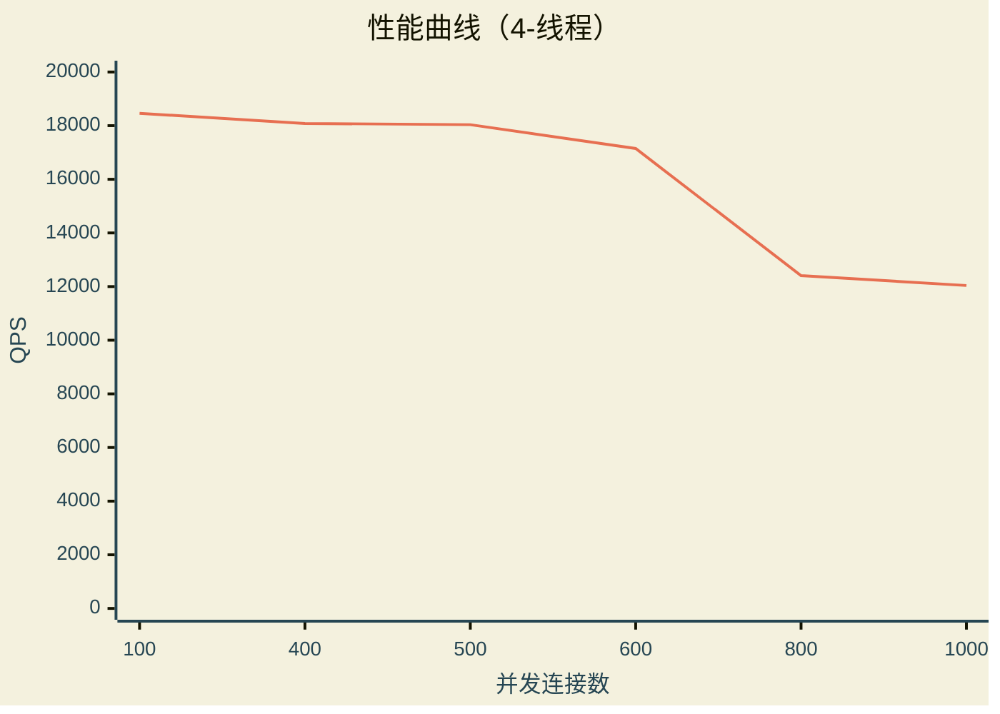
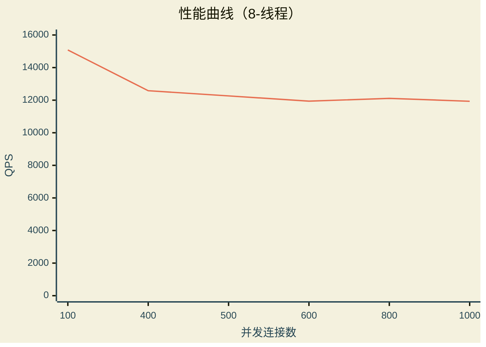
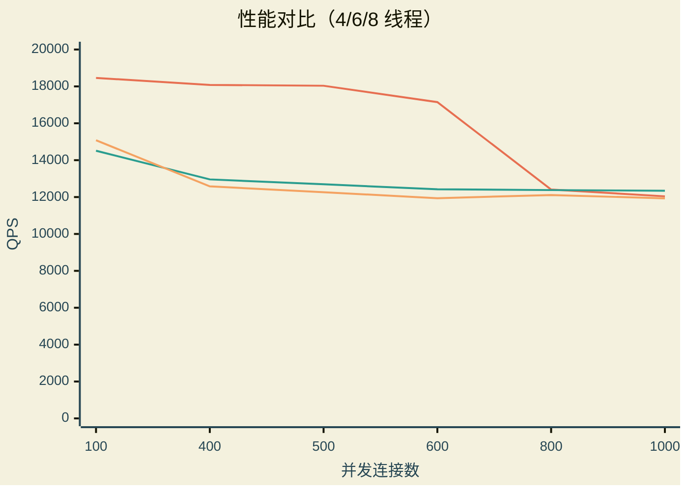

# 压力测试

> 该压力测试基于 **wrk** 工具
> ***[wrk tool](https://github.com/wg/wrk)***

使用示例

```bash
:$ wrk -t8 -c400 -d30s http://<静态文件>

:$ wrk -t8 -c400 -d30s http://localhost:8080/index.html
```

## 测试平台

```text
Operating System: Fedora Linux 43
KDE Plasma Version: 6.6.4
KDE Frameworks Version: 6.25.0
Qt Version: 6.10.3
Kernel Version: 6.19.11-200.fc43.x86_64 (64-bit)
Graphics Platform: Wayland

Processors: 8 × Intel® Core™ i5-8250U CPU @ 1.60GHz
Memory: 8 GiB of RAM (7.6 GiB usable)
Graphics Processor: Intel® UHD Graphics 620

Manufacturer: Acer
Product Name: Swift SF514-52T
System Version: V1.07
```

## 测试

以下测试以 `./http_server --threads 8` 为测试基础

### 4 线程测试

以下压力测试参数基于：4线程，[100 400 500 600 800 1000] 连接、30秒

```bash
$ ./wrk -t4 -c100 -d30s http://0.0.0.0:8080/index.html

Running 30s test @ http://0.0.0.0:8080/index.html
  4 threads and 100 connections
  Thread Stats   Avg      Stdev     Max   +/- Stdev
    Latency     5.41ms    2.31ms 102.23ms   90.48%
    Req/Sec     4.64k   349.58     7.21k    78.63%
  555545 requests in 30.10s, 4.78GB read
Requests/sec:  18458.70
Transfer/sec:    162.59MB
```

```bash
$ ./wrk -t4 -c400 -d30s http://0.0.0.0:8080/index.html

Running 30s test @ http://0.0.0.0:8080/index.html
  4 threads and 400 connections
  Thread Stats   Avg      Stdev     Max   +/- Stdev
    Latency    28.23ms   71.87ms   1.65s    98.89%
    Req/Sec     4.55k   282.99     6.47k    78.86%
  544160 requests in 30.10s, 4.68GB read
Requests/sec:  18080.87
Transfer/sec:    159.26MB
```

```bash
$ ./wrk -t4 -c500 -d30s http://0.0.0.0:8080/index.html

Running 30s test @ http://0.0.0.0:8080/index.html
  4 threads and 500 connections
  Thread Stats   Avg      Stdev     Max   +/- Stdev
    Latency    34.48ms   84.69ms   1.99s    98.97%
    Req/Sec     4.54k   278.88     7.97k    81.10%
  542222 requests in 30.06s, 4.66GB read
  Socket errors: connect 0, read 0, write 0, timeout 34
Requests/sec:  18036.37
Transfer/sec:    158.87MB
```

```bash
$ ./wrk -t4 -c600 -d30s http://0.0.0.0:8080/index.html

Running 30s test @ http://0.0.0.0:8080/index.html
  4 threads and 600 connections
  Thread Stats   Avg      Stdev     Max   +/- Stdev
    Latency    39.33ms   69.30ms   1.99s    99.30%
    Req/Sec     4.32k   520.40     5.73k    84.70%
  515057 requests in 30.04s, 4.43GB read
  Socket errors: connect 0, read 0, write 0, timeout 33
Requests/sec:  17147.19
Transfer/sec:    151.03MB
```

```bash
$ ./wrk -t4 -c800 -d30s http://0.0.0.0:8080/index.html

Running 30s test @ http://0.0.0.0:8080/index.html
  4 threads and 800 connections
  Thread Stats   Avg      Stdev     Max   +/- Stdev
    Latency    62.27ms   53.36ms   1.99s    99.56%
    Req/Sec     3.13k   224.33     4.25k    74.83%
  373251 requests in 30.08s, 3.21GB read
  Socket errors: connect 0, read 0, write 0, timeout 295
Requests/sec:  12410.06
Transfer/sec:    109.31MB
```

```bash
$ ./wrk -t4 -c1000 -d30s http://0.0.0.0:8080/index.html

Running 30s test @ http://0.0.0.0:8080/index.html
  4 threads and 1000 connections
  Thread Stats   Avg      Stdev     Max   +/- Stdev
    Latency    73.21ms   49.36ms   1.98s    99.41%
    Req/Sec     3.03k   257.93     4.05k    71.57%
  362627 requests in 30.12s, 3.12GB read
  Socket errors: connect 0, read 0, write 0, timeout 474
Requests/sec:  12038.91
Transfer/sec:    106.04MB
```

### 6 线程测试

以下压力测试参数基于：6线程，[100 400 500 600 800 1000] 连接、30秒

```bash
$ ./wrk -t6 -c100 -d30s http://0.0.0.0:8080/index.html

Running 30s test @ http://0.0.0.0:8080/index.html
  6 threads and 100 connections
  Thread Stats   Avg      Stdev     Max   +/- Stdev
    Latency     6.59ms    2.15ms  72.85ms   79.37%
    Req/Sec     2.44k   495.26     8.07k    61.67%
  436560 requests in 30.09s, 3.76GB read
Requests/sec:  14510.87
Transfer/sec:    127.81MB
```

```bash
$ ./wrk -t6 -c400 -d30s http://0.0.0.0:8080/index.html

Running 30s test @ http://0.0.0.0:8080/index.html
  6 threads and 400 connections
  Thread Stats   Avg      Stdev     Max   +/- Stdev
    Latency    37.98ms   87.72ms   1.99s    98.87%
    Req/Sec     2.17k   159.63     3.95k    80.99%
  389787 requests in 30.08s, 3.35GB read
  Socket errors: connect 0, read 0, write 0, timeout 8
Requests/sec:  12958.19
Transfer/sec:    114.14MB
```

```bash
$ ./wrk -t6 -c500 -d30s http://0.0.0.0:8080/index.html

Running 30s test @ http://0.0.0.0:8080/index.html
  6 threads and 500 connections
  Thread Stats   Avg      Stdev     Max   +/- Stdev
    Latency    44.24ms   77.44ms   2.00s    99.11%
    Req/Sec     2.13k   198.15     2.99k    72.35%
  381895 requests in 30.08s, 3.28GB read
  Socket errors: connect 0, read 0, write 0, timeout 89
Requests/sec:  12694.30
Transfer/sec:    111.81MB
```

```bash
$ ./wrk -t6 -c600 -d30s http://0.0.0.0:8080/index.html

Running 30s test @ http://0.0.0.0:8080/index.html
  6 threads and 600 connections
  Thread Stats   Avg      Stdev     Max   +/- Stdev
    Latency    50.79ms   68.39ms   1.98s    99.30%
    Req/Sec     2.09k   159.53     5.85k    85.52%
  373879 requests in 30.10s, 3.22GB read
  Socket errors: connect 0, read 0, write 0, timeout 177
Requests/sec:  12421.31
Transfer/sec:    109.41MB
```

```bash
$ ./wrk -t6 -c800 -d30s http://0.0.0.0:8080/index.html

Running 30s test @ http://0.0.0.0:8080/index.html
  6 threads and 800 connections
  Thread Stats   Avg      Stdev     Max   +/- Stdev
    Latency    61.91ms   56.26ms   1.98s    99.52%
    Req/Sec     2.08k   215.17     3.05k    75.47%
  372486 requests in 30.09s, 3.20GB read
  Socket errors: connect 0, read 0, write 0, timeout 331
Requests/sec:  12378.54
Transfer/sec:    109.03MB
```

```bash
$ ./wrk -t6 -c1000 -d30s http://0.0.0.0:8080/index.html

Running 30s test @ http://0.0.0.0:8080/index.html
  6 threads and 1000 connections
  Thread Stats   Avg      Stdev     Max   +/- Stdev
    Latency    69.70ms   50.81ms   2.00s    99.51%
    Req/Sec     2.07k   187.29     2.97k    75.98%
  371498 requests in 30.10s, 3.20GB read
  Socket errors: connect 0, read 0, write 0, timeout 531
Requests/sec:  12344.02
Transfer/sec:    108.73MB
```

### 8 线程测试

以下压力测试参数基于：8线程，[100 400 500 600 800 1000] 连接、30秒

```bash
$ ./wrk -t8 -c100 -d30s http://0.0.0.0:8080/index.html

Running 30s test @ http://0.0.0.0:8080/index.html
  8 threads and 100 connections
  Thread Stats   Avg      Stdev     Max   +/- Stdev
    Latency     6.37ms    2.31ms  93.96ms   84.06%
    Req/Sec     1.90k   378.30     5.25k    60.79%
  453337 requests in 30.06s, 3.90GB read
Requests/sec:  15079.99
Transfer/sec:    132.83MB
```

```bash
$ ./wrk -t8 -c400 -d30s http://0.0.0.0:8080/index.html

Running 30s test @ http://0.0.0.0:8080/index.html
  8 threads and 400 connections
  Thread Stats   Avg      Stdev     Max   +/- Stdev
    Latency    39.98ms   92.70ms   1.99s    98.72%
    Req/Sec     1.58k   181.23     3.44k    83.32%
  378337 requests in 30.07s, 3.25GB read
  Socket errors: connect 0, read 0, write 0, timeout 44
Requests/sec:  12580.47
Transfer/sec:    110.81MB
```

```bash
$ ./wrk -t8 -c500 -d30s http://0.0.0.0:8080/index.html

Running 30s test @ http://0.0.0.0:8080/index.html
  8 threads and 500 connections
  Thread Stats   Avg      Stdev     Max   +/- Stdev
    Latency    45.21ms   77.46ms   2.00s    99.12%
    Req/Sec     1.54k   167.09     2.58k    70.07%
  369066 requests in 30.10s, 3.17GB read
  Socket errors: connect 0, read 0, write 0, timeout 107
Requests/sec:  12262.20
Transfer/sec:    108.01MB
```

```bash
$ ./wrk -t8 -c600 -d30s http://0.0.0.0:8080/index.html

Running 30s test @ http://0.0.0.0:8080/index.html
  8 threads and 600 connections
  Thread Stats   Avg      Stdev     Max   +/- Stdev
    Latency    51.90ms   70.44ms   2.00s    99.22%
    Req/Sec     1.50k   216.14     2.69k    83.73%
  359215 requests in 30.09s, 3.09GB read
  Socket errors: connect 0, read 0, write 0, timeout 244
Requests/sec:  11939.31
Transfer/sec:    105.16MB
```

```bash
$ ./wrk -t8 -c800 -d30s http://0.0.0.0:8080/index.html

Running 30s test @ http://0.0.0.0:8080/index.html
  8 threads and 800 connections
  Thread Stats   Avg      Stdev     Max   +/- Stdev
    Latency    63.22ms   56.11ms   1.99s    99.53%
    Req/Sec     1.52k   230.23     2.61k    81.19%
  363975 requests in 30.06s, 3.13GB read
  Socket errors: connect 0, read 0, write 0, timeout 333
Requests/sec:  12109.71
Transfer/sec:    106.66MB
```

```bash
$ ./wrk -t8 -c1000 -d30s http://0.0.0.0:8080/index.html

Running 30s test @ http://0.0.0.0:8080/index.html
  8 threads and 1000 connections
  Thread Stats   Avg      Stdev     Max   +/- Stdev
    Latency    72.42ms   52.16ms   1.98s    99.49%
    Req/Sec     1.50k   196.46     2.74k    71.48%
  359024 requests in 30.09s, 3.09GB read
  Socket errors: connect 0, read 0, write 0, timeout 521
Requests/sec:  11931.96
Transfer/sec:    105.10MB
```

## 性能汇总








## END

