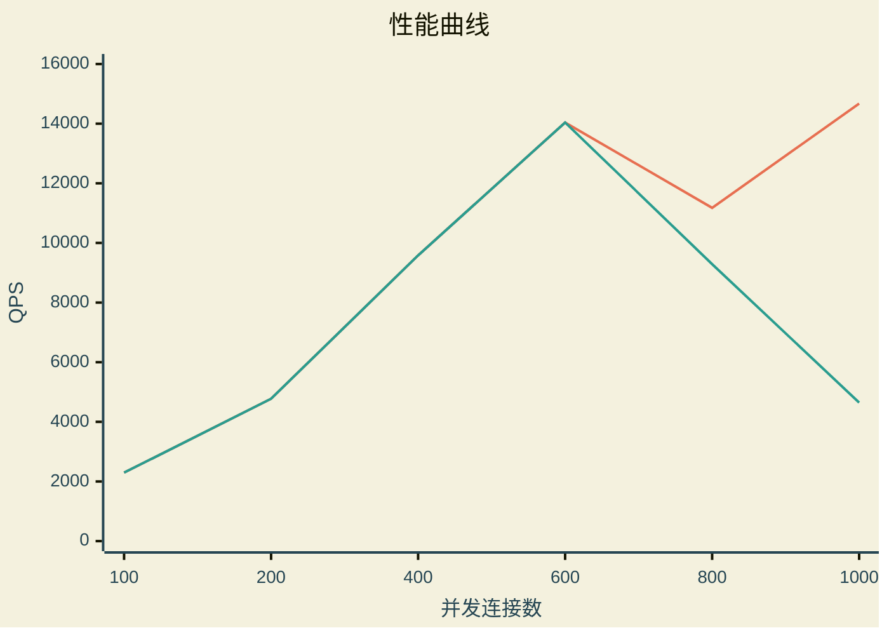

# 压力测试

> 该压力测试基于 **wrk** 工具
> ***[wrk tool](https://github.com/wg/wrk)***
>

使用示例

```bash
:$ wrk -t8 -c400 -d30s http://<静态文件>

:$ wrk -t8 -c400 -d30s http://localhost:8080/index.html
```

## 测试平台

```text
Operating System: Fedora Linux 43
KDE Plasma Version: 6.6.4
KDE Frameworks Version: 6.25.0
Qt Version: 6.10.3
Kernel Version: 6.19.11-200.fc43.x86_64 (64-bit)
Graphics Platform: Wayland

Processors: 8 × Intel® Core™ i5-8250U CPU @ 1.60GHz
Memory: 8 GiB of RAM (7.6 GiB usable)
Graphics Processor: Intel® UHD Graphics 620

Manufacturer: Acer
Product Name: Swift SF514-52T
System Version: V1.07
```

## 测试

以下测试以 `./http_server --threads 8` 为测试基础

以下压力测试参数基于：8线程，[100 200 400 600 800 1000]、30秒

```bash
$ ./wrk -t8 -c100 -d30s http://0.0.0.0:8080/index.html

Running 30s test @ http://0.0.0.0:8080/index.html
  8 threads and 100 connections
  Thread Stats   Avg      Stdev     Max   +/- Stdev
    Latency    41.71ms    1.91ms 132.20ms   96.21%
    Req/Sec   288.64     26.01   363.00     65.94%
  69084 requests in 30.09s, 608.87MB read
Requests/sec:   2295.91
Transfer/sec:     20.24MB
```

```bash
$ ./wrk -t8 -c200 -d30s http://0.0.0.0:8080/index.html

Running 30s test @ http://0.0.0.0:8080/index.html
  8 threads and 200 connections
  Thread Stats   Avg      Stdev     Max   +/- Stdev
    Latency    41.77ms    2.00ms  81.22ms   93.09%
    Req/Sec   600.19     49.03   757.00     66.54%
  143658 requests in 30.09s, 1.24GB read
Requests/sec:   4773.95
Transfer/sec:     42.08MB
```

```bash
$ ./wrk -t8 -c400 -d30s http://0.0.0.0:8080/index.html

Running 30s test @ http://0.0.0.0:8080/index.html
  8 threads and 400 connections
  Thread Stats   Avg      Stdev     Max   +/- Stdev
    Latency    41.64ms    2.05ms 104.60ms   97.13%
    Req/Sec     1.20k    71.01     1.40k    77.08%
  287979 requests in 30.05s, 2.48GB read
Requests/sec:   9581.91
Transfer/sec:     84.45MB
```

```bash
$ ./wrk -t8 -c600 -d30s http://0.0.0.0:8080/index.html
Running 30s test @ http://0.0.0.0:8080/index.html
  8 threads and 600 connections
  Thread Stats   Avg      Stdev     Max   +/- Stdev
    Latency    42.60ms    3.29ms 195.66ms   93.88%
    Req/Sec     1.77k   139.11     2.21k    72.42%
  422457 requests in 30.09s, 3.64GB read
Requests/sec:  14038.62
Transfer/sec:    123.73MB
```

```bash
$ ./wrk -t8 -c800 -d30s http://0.0.0.0:8080/index.html
Running 30s test @ http://0.0.0.0:8080/index.html
  8 threads and 800 connections
  Thread Stats   Avg      Stdev     Max   +/- Stdev
    Latency    58.37ms   29.32ms   1.08s    81.89%
    Req/Sec     1.41k   497.77     2.58k    60.45%
  336367 requests in 30.10s, 2.41GB read
  Non-2xx or 3xx responses: 56814
Requests/sec:  11176.80
Transfer/sec:     82.11MB
```

```bash
$ ./wrk -t8 -c1000 -d30s http://0.0.0.0:8080/index.html

Running 30s test @ http://0.0.0.0:8080/index.html
  8 threads and 1000 connections
  Thread Stats   Avg      Stdev     Max   +/- Stdev
    Latency    51.38ms   22.48ms 714.20ms   71.71%
    Req/Sec     1.85k   622.61     3.40k    56.97%
  441681 requests in 30.10s, 1.25GB read
  Non-2xx or 3xx responses: 301848
Requests/sec:  14674.03
Transfer/sec:     42.38MB
```



## END

